# 剧情分支系统设计（v4）

> 对应 PRD v0.1 剧情章节的机制升级版：从"单线剧情 + 双结局"升级为"伞形多结局 + 唯一真结局"。
> 日期：2026-08-07 · 状态：设计已与需求方确认，待实现
> 配套实现计划：`docs/plans/2026-08-07-goose-escape-mvp.md`（M3 章节玩法部分需按本文档调整）

## 1. 设计目标

1. 让"选择的权利"从台词变成机制——莞小鹅在每一站都真实地做一次"留下 / 继续"的抉择。
2. 结局体系支撑多周目收集：一次游玩最多拿 6 沿途印记 + 1 结局印记，全收集需多周目。
3. 真结局（介绍东莞）与莞小鹅 IP 的现实定位（东莞烧鹅文化"宣传大使"）形成闭环。

## 2. 流程总览

```mermaid
flowchart LR
  P0["序章 · 鹅厂<br/>强制教学"] --> P1["篮球馆"]
  P1 --> P1C{抉择<br/>留下训练 / 继续探寻}
  P1C -- 留下 --> P1E["记：篮球人生"]
  P1E --> P2["荔枝园"]
  P1C -- 继续 --> P2
  P2 --> P2C{抉择<br/>留下种荔枝 / 继续探寻}
  P2C -- 留下 --> P2E["记：荔枝传人"]
  P2E --> P3["烧鹅店"]
  P2C -- 继续 --> P3
  P3 --> P3C{抉择<br/>留下做烧鹅 / 继续探寻}
  P3C -- 留下 --> P3E["记：烧鹅传人"]
  P3E --> P4["工业园"]
  P3C -- 继续 --> P4
  P4 --> P4C{抉择<br/>留下研发 / 继续探寻}
  P4C -- 留下 --> P4E["记：科技新星"]
  P4E --> P5["DGUT"]
  P4C -- 继续 --> P5
  P5 --> P5C{抉择<br/>留下入学 / 继续探寻}
  P5C -- 留下 --> P5E["记：大学新生"]
  P5E --> P6["松山湖"]
  P5C -- 继续 --> P6
  P6 --> P6C{走马灯后}
  P6C -- 有留下记录 --> P6E["决定去留过的场景 → 触发对应 CG"]
  P6C -- 全程未留 --> P6T["介绍东莞 CG（真结局）"]
```

## 3. 抉择规则

| 规则 | 说明 |
| --- | --- |
| 场景强制进入 | 篮球馆、荔枝园、烧鹅店、工业园、DGUT 依次进入，**无跳过选项** |
| 唯一留下 | 全旅程只能选一个场景"留下"，该选择被记录 |
| 锁定反馈 | 首次选"留下"后，后续所有场景的"留下"按钮置灰不可选（"继续探寻"仍可选） |
| 松山湖无抉择 | 松山湖终章不再出现"留下 / 离开"选项，改为走马灯后的"决定去留过的场景" |

## 4. 结局体系（6 个 CG）

| # | 结局 | 触发条件 | 印记 |
| --- | --- | --- | --- |
| 1 | 篮球人生 | 篮球馆选"留下" | 训练营（生涯） |
| 2 | 荔枝传人 | 荔枝园选"留下" | 荔枝园丁（生涯） |
| 3 | 烧鹅传人 | 烧鹅店选"留下" | 烧鹅师傅（生涯） |
| 4 | 科技新星 | 工业园选"留下" | 研发者（生涯） |
| 5 | 大学新生 | DGUT 选"留下" | 大学生（生涯） |
| 6 | **介绍东莞（真结局）** | 全程未选"留下" | 湖光 |

- 松山湖走马灯回顾**去过的场景**（全部场景都去过，素材为各场景高光/抉择点回放）。
- 有留下记录 → 莞小鹅"决定去对应场景" → 触发该场景专属 CG 结局。
- 全程未留 → 莞小鹅觉醒，决定留下**介绍东莞**（真结局，格局最大）。
- 结局面板提供"再选一次"，支持回看其他结局（复用现成 EndingOverlay 组件）。

## 5. 印记体系

| 分类 | 印记 | 获得方式 |
| --- | --- | --- |
| 沿途（必得） | 出厂合格证 / 篮球徽章 / 妃子笑 / 莞香烧鹅 / 工业齿轮 / 校园书签 | 各场景剧情完成自动获得 |
| 结局（唯一） | 训练营 / 荔枝园丁 / 烧鹅师傅 / 研发者 / 大学生 / 湖光 | 松山湖终局按选择结算，一次游玩仅 1 枚 |

一次游玩最多 7 枚（6 沿途 + 1 结局）；全收集（6 结局印记 + 湖光）需多周目，收集进度由章节地图与结局面板展示。

## 6. 叙事要点

1. **劳动者致敬双点**：荔枝园新增"农民真伟大"台词，与工业园"工人阶级真伟大"呼应。
2. **主题闭环**：第五章学姐"你有选择的权利"是文眼；机制上玩家确实在每站做选择；真结局"介绍东莞"与 IP 现实定位对齐。
3. **只能留一个的张力**：玩家权衡"抓住眼前的小确幸"还是"看遍整座城"；真结局不是奖励堆出来的，而是拒绝中途停留的格局之选。
4. 烧鹅店"同类相食"笑点保留（莞小鹅为烧鹅造型潮玩偷吃真烧鹅）。

## 7. 实现影响（对现有代码）

| 模块 | 改动 |
| --- | --- |
| `src/data/chapters.js` | 章节数据增加抉择点定义（`choice: { label, ending, badge }`） |
| `src/data/badges.js` | 新增 6 枚结局印记（5 生涯 + 湖光已存在） |
| `src/data/dialogues.js` | 各章节抉择前后对话、结局 CG 文案 |
| `src/core/SaveSystem.js` | 存档增加 `choice` 字段（记录留下场景 id 或 null） |
| 抉择 UI | 抽取松山湖现有抉择覆盖层为通用组件 `ChoiceOverlay` |
| 各场景类 | 章节末尾接入抉择点：留下 → 记录 + 后续"留下"置灰；继续 → 推进 |
| 松山湖场景 | 改为走马灯 + 结算分支（去留过场景 / 介绍东莞），移除原"离开"选项 |
| 章节地图 | 展示已选"留下"的场景状态（高亮/灰）与各结局印记收集状态 |
| CG | 6 个结局 CG 首版以"场景定格 + 文案"实现，插画美术后置 `[待确认]` |

## 8. 待确认

- CG 美术形式：插画 / 场景定格动画（影响美术资源清单）。
- 全收集成就名（6 结局 + 湖光集齐）待定。
- "介绍东莞"真结局的具体呈现（是否展示城市图鉴/景点清单）。

## 9. 与原 PRD 的差异清单

| 原设计 | 新设计 |
| --- | --- |
| 松山湖抉择"留下 / 离开"双结局 | 5 个中途场景各有"留下 / 继续"抉择 + 松山湖走马灯结算 |
| 离开结局（不解锁湖光） | 取消；改为中途场景结局 + 真结局（介绍东莞） |
| 印记：6 沿途 + 湖光 | 印记：6 沿途 + 6 结局印记（唯一） |
| 单线剧情 | 伞形多结局（可多周目） |
